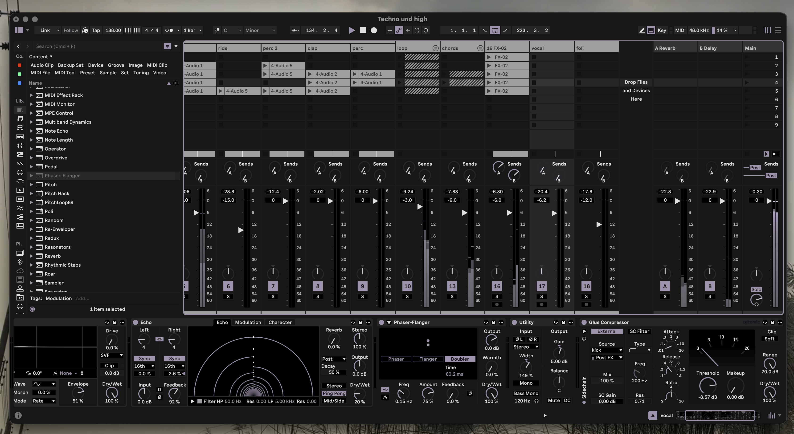

# MORDIO Ableton Live Themes

Three custom dark themes for Ableton Live 12.

## Aether Mono

Monochrome. Grey scales from background to selection, with a single lavender accent. VU meters fade grey to lavender, red only when you clip.

## Mordio Aether

Pure black. Lila and teal accents.

## Mordio Studio

Dark gray base. Mint and lavender accents.

## Installation

1. Download the `.ask` file from [Releases](https://github.com/M0RDI0/mordio-ableton-theme/releases) or straight from this repo
2. Copy it into your user Themes folder (no admin rights needed):
   - **macOS:** `~/Library/Application Support/Ableton/Live 12/Resources/Themes/`
   - **Windows:** `C:\Users\YOURNAME\AppData\Roaming\Ableton\Live 12\Resources\Themes\`
3. Ableton > Preferences > Display (Look/Feel) > select the theme

Requires Ableton Live 12. Works with Intro, Standard and Suite.
