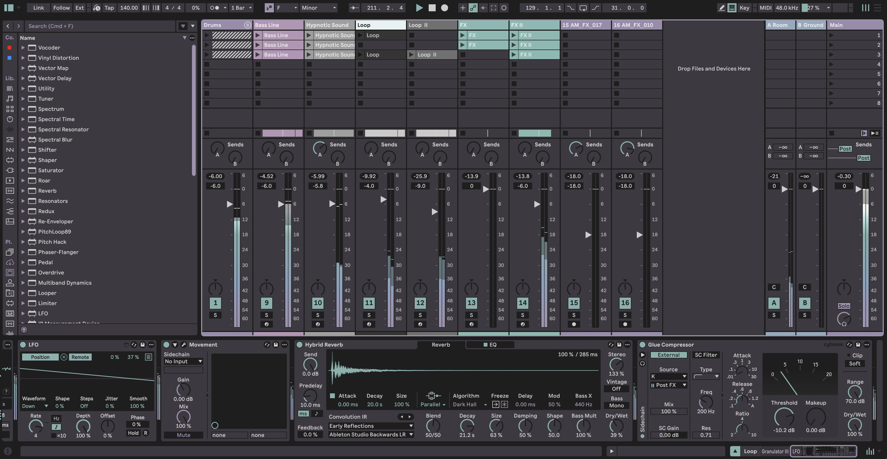
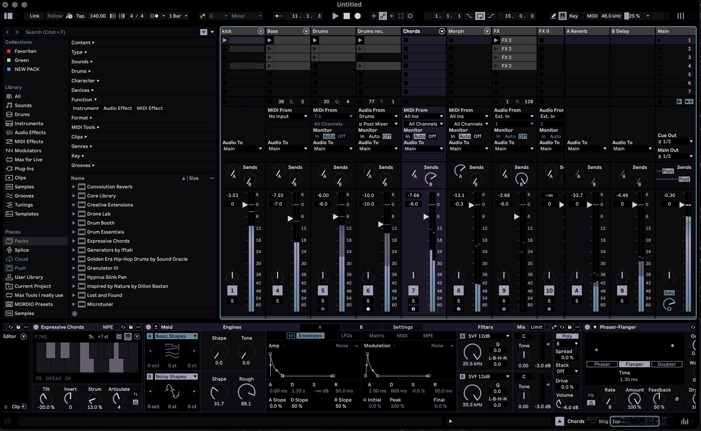

# MORDIO Ableton Live Themes

Three custom dark themes for Ableton Live 12.

## Aether

The original MORDIO look. Dark base, lavender accents.

## Mono

Monochrome. Grey scales from background to selection, with a single lavender accent. VU meters fade grey to lavender, red only when you clip.

## Studio

Higher-contrast variant. Turquoise and lavender accents.

## Installation

1. Quit Ableton Live completely, then download the `.ask` file you want from this repo, or get all three free in one pack: https://mordio.online/shop/ableton-themes-essentials
2. Copy it into Ableton's Themes folder:
   - **macOS:** `~/Library/Application Support/Ableton/Live 12/Resources/Themes/` (create the Themes folder if it doesn't exist)
   - **Windows:** `C:\ProgramData\Ableton\Live 12 Suite\Resources\Themes\` (folder name matches your edition: Suite, Standard or Intro; ProgramData is hidden, paste the path into the File Explorer address bar)
3. Open Live, go to Settings (Preferences in older versions) > Theme & Colors > select the theme

If a theme doesn't show up, quit Live completely and reopen it.

Requires Ableton Live 12. Works with Intro, Standard and Suite.
